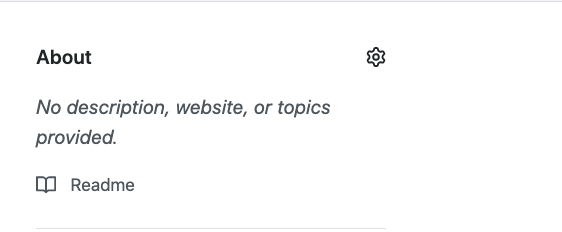
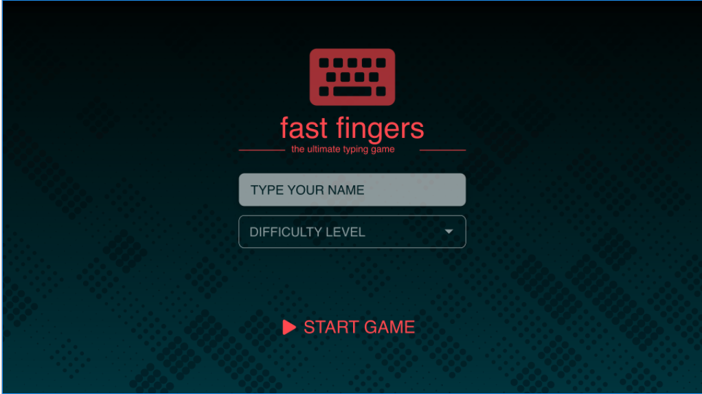
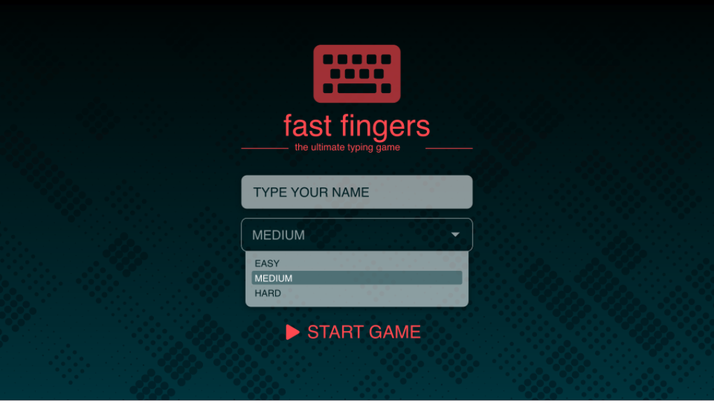
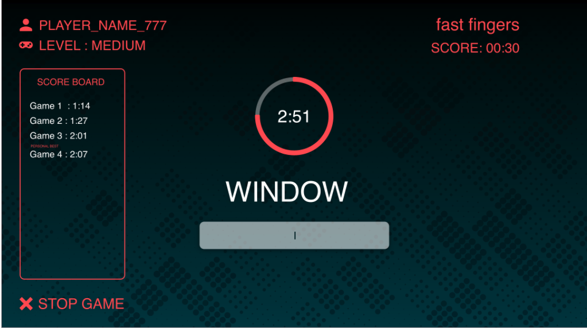
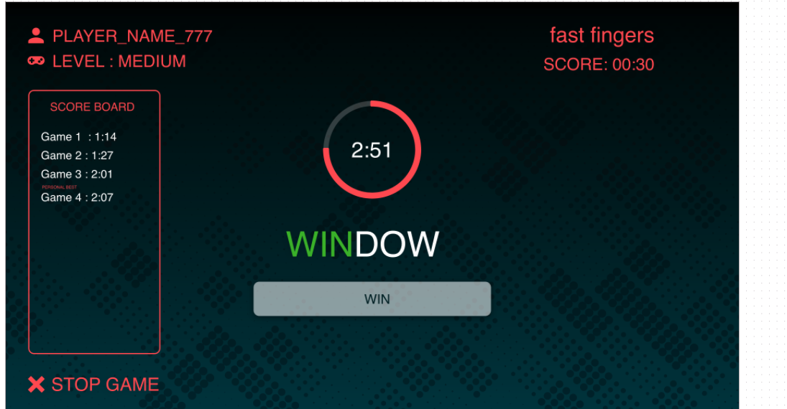
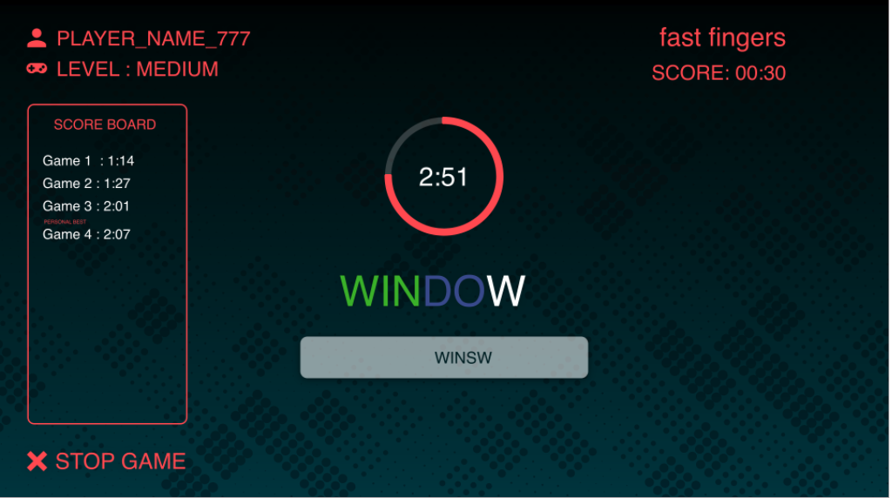
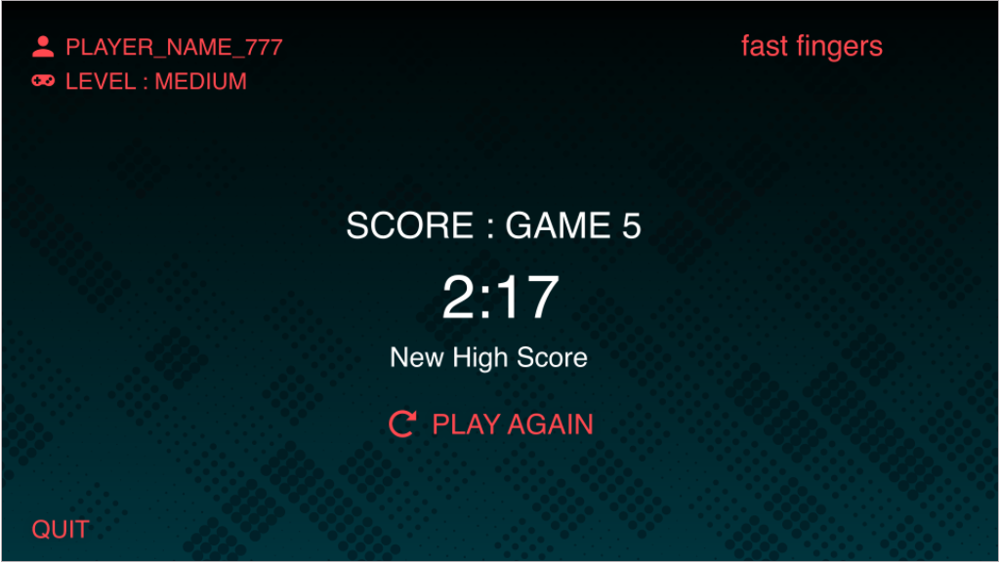

# Fast Fingers

Find the backend at https://github.com/raman32/fast-finger-backend

Pesto Tech is proudly launching its own speed typing game named **Fast fingers**. You have been awarded with the project and you need to design and develop this project which should
meet the requirements mentioned in the MVP below.

## MVP Requirement

1. Ask player to enter his/her name before starting the game.

   - Do not ask player to enter his/her name again if he plays the game again in the same session.
   - Show proper error message if player doesn't enter his/her name and clicks on `START GAME`.

2. Set Default difficulty level to `EASY`. User should be able to change the difficulty level using dropdown.
3. Start the game on `START GAME` button click.

4. Show random word from dictionary and an input box on game screen.

- For `EASY` difficulty level, word length should be less than or equal to 4.
- For `MEDIUM` difficulty level, word length should be between 5-8(noth numbers included).
- For `HARD` difficulty level, word length should be greater than 8.

5. As soon as the typed word matches the word shown on screen, it should we considered submitted (pressing "ENTER" button shall not be required to submit a word). Empty the input box after a successful attempt.

6. A timer shall be shown on the screen for every word and the maximum time that an user is allowed to type a word will depend on the difficulty factor. Refer to the formula provided below to calculate the maximum time allowed :

Timer value = (Number of letters in the word) / (Difficulty factor)

Round the timer value to nearest integer bigger than the value.

Initially the difficulty factor would be 1 and it will keep increasing as the player progresses in the game and the timer value is guaranteed to be greater than or equal to 2 seconds that means a player must get at least 2 seconds to type a word. So whenever the calculated value is found to be less than 2 seconds, it should be rounded off to 2 seconds always.

7. There are three levels in game: EASY, MEDIUM and HARD

Difficulty factor for easy level: 1

Difficulty factor for medium level: 1.5

Difficulty factor for hard level: 2

8. Increase difficulty factor by 0.01 after every successful word attempt.

9. Change the game level if difficulty factor crosses particular levels difficulty factor.

10. Player should be able to stop the game by clicking on `STOP GAME` button
11. **Game score for the player is the total time player was able to remain in the game before game gets over either because his/her time runs out for a particular word or player Stops the game**.
12. Show previous games score for player in a sidebar

13. Show best score for player
14. Application UI should closely match with the provided UI design mocks.

**Note: Please deploy your application to Netlify(no other platforms allowed at this point) and Add your Application link to website section in About field**

## Additional Requirement

- Write Test cases for your components.

## Tips

- Deploy your application in very early stage and then do continous development.
- Test your application in Google Chrome, Mozilla firefox and Internet explorer 11.

## UI Design mocks

UI design mocks are available in `design-mocks` folder

|                         |                         |
| :---------------------: | :---------------------: |
|  |  |
|  |  |
|  |  |

[Adobe XD design link](https://drive.google.com/file/d/1qYhb8cNdXoBnD9rxoDcWF4DmTEpQX35n/view?usp=sharing)

[Zeplin web link](https://zpl.io/a710mxj)

Zeplin App Link: zpl://project?pid=5f75f13621f33094313f2b94

## Allowed Tech stack

- HTML, CSS, JavaScript
- Bootstrap
- ReactJS
- SCSS
- DOM Testing Library
- Jest and React Testing Library

**NOTE: React Component libraries like Material UI, Antd, Chakra UI are not allowed**
